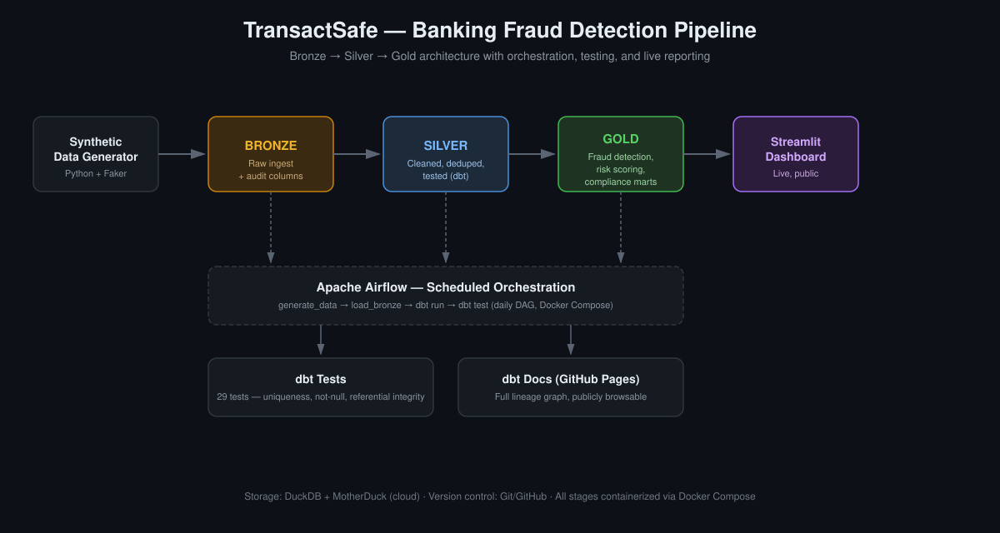

# TransactSafe — Banking Fraud Detection Data Pipeline

A production-style data engineering pipeline that ingests raw banking transaction data, cleans and validates it through a bronze/silver/gold medallion architecture, and surfaces rule-based fraud detection and risk scoring — orchestrated on a schedule, fully tested, and deployed live.

**🔗 Live Dashboard:** [banking-lakehouse-pipeline.streamlit.app](https://banking-lakehouse-pipeline.streamlit.app)
**🔗 Data Lineage / Documentation:** [obaydawan.github.io/banking-lakehouse-pipeline](https://obaydawan.github.io/banking-lakehouse-pipeline/)



---

## The Problem

Financial institutions process millions of transactions daily and are required — under frameworks like the EU's Anti-Money Laundering Directives — to detect suspicious patterns quickly while maintaining clean, auditable data lineage. Most portfolio "data pipeline" projects stop at moving data from A to B. This project instead simulates the actual constraints a fraud/compliance data team operates under: auditability, enforced data quality, and business-usable outputs.

Full problem framing and architectural decisions are documented in [`PROJECT_CHARTER.md`](PROJECT_CHARTER.md).

## What It Does

1. **Generates realistic synthetic banking data** — customers, accounts, and transactions — with intentionally embedded data quality issues (nulls, duplicates, orphaned foreign keys) and three fraud patterns (velocity bursts, geographic anomalies, statistical outliers).
2. **Ingests it into a bronze layer** — raw, untouched, with audit columns for traceability.
3. **Cleans and validates it in a silver layer** (dbt) — deduplication, null handling, referential integrity — enforced by 11 automated tests.
4. **Detects fraud in a gold layer** (dbt) — three rule-based detection methods feeding into an account-level risk score (None/Low/Medium/High tiers) — enforced by 18 more automated tests.
5. **Orchestrates the whole flow on a schedule** via Apache Airflow (Dockerized).
6. **Surfaces results in a live dashboard** (Streamlit) for a fraud analyst persona.
7. **Publishes full data lineage** via dbt docs on GitHub Pages.

## Architecture

| Layer | Purpose |
|---|---|
| **Bronze** | Raw ingestion, zero transformation, audit columns (`_ingested_at`, `_source_file`) |
| **Silver** | Cleaned, deduplicated, referentially valid — `stg_customers`, `stg_accounts`, `stg_transactions` |
| **Gold** | `fct_flagged_transactions`, `dim_account_risk_scores`, `mart_monthly_compliance_summary` |
| **Orchestration** | Apache Airflow — daily DAG: generate → ingest → transform → test |
| **Storage** | DuckDB (local) + MotherDuck (cloud) |
| **Transformation** | dbt-duckdb |
| **Dashboard** | Streamlit, deployed publicly |

## Fraud Detection Logic

Three independent rules feed into a presence-based risk score (not diluted by an account's overall transaction volume — a real methodology decision explained below):

- **Velocity fraud** — 6+ transactions from the same account within a rolling 30-minute window
- **Geographic anomaly** — transactions originating from higher-risk countries
- **Statistical outlier** — transaction amount far above an account's own baseline, with a global-percentile fallback for low-volume accounts to avoid the "cold start" problem

## Engineering Decisions Worth Highlighting

This section exists because a working pipeline is table stakes — the reasoning behind it is what's actually being evaluated.

**Risk scoring was redesigned mid-build.** The first version scored risk as *flagged transactions ÷ total transactions*. This diluted the signal: an account with a 6-transaction fraud burst buried in 25 normal transactions scored as "Low risk" — exactly backwards, since fraud hidden among normal activity is the realistic case. Switched to presence-based severity weighting (a confirmed fraud pattern contributes a fixed score regardless of surrounding activity), then validated the fix against known ground truth (planted fraud accounts correctly landed in the High tier).

**The outlier rule had a cold-start bias.** Per-account standard deviation is unstable with few data points — a single ordinary large purchase could blow past 3σ for a low-volume account, causing ~1,200 false positives against 30 planted true positives. Fixed by falling back to a global percentile threshold for accounts with under 10 transactions. False positive count dropped to a defensible range.

**A relative file path broke silently between local and cloud environments.** The Streamlit dashboard used a `../` relative path that worked locally (where the working directory is the `dashboard/` folder) but failed on Streamlit Cloud (where the working directory is the repo root regardless of the app's subfolder). Fixed by resolving the path via the script's own file location instead of the working directory — a good reminder that "works on my machine" and "works when deployed" are different claims.

Full detail on all decisions, including tradeoffs considered, in [`PROJECT_CHARTER.md`](PROJECT_CHARTER.md).

## Data Quality & Testing

29 automated dbt tests across the silver and gold layers — all passing. Full breakdown, including what each test category protects against, in [`TEST_REPORT.md`](TEST_REPORT.md).

## Tech Stack

Python · dbt · DuckDB · MotherDuck · Apache Airflow · Docker · Streamlit · Plotly · Git/GitHub

## Repository Structure

```
├── PROJECT_CHARTER.md          # Problem statement, architecture decisions, tradeoffs
├── TEST_REPORT.md              # Automated data quality test coverage report
├── data_generator/             # Synthetic data generation with embedded fraud patterns
├── bronze/                     # Raw ingestion scripts
├── dbt_project/transactsafe/   # Silver + gold layer transformations and tests
├── airflow/                    # Docker Compose + orchestration DAG
├── dashboard/                  # Streamlit fraud analyst dashboard
├── scripts/                    # Utility scripts (test report generator)
└── docs/                       # Published dbt documentation (GitHub Pages)
```

## Running It Locally

```bash
# 1. Set up environment
python3 -m venv .venv && source .venv/bin/activate
pip install -r requirements.txt

# 2. Generate synthetic data
cd data_generator && python generate_data.py

# 3. Load bronze layer
cd ../bronze && python load_bronze.py

# 4. Run transformations + tests
cd ../dbt_project/transactsafe
dbt run && dbt test

# 5. Launch dashboard
cd ../../dashboard && streamlit run app.py
```

## Future Work

- Real-time streaming ingestion (Kafka)
- ML-based risk scoring model (current scoring is intentionally rule-based for transparency)
- CI/CD pipeline running dbt tests on every pull request
- Role-based access control simulation for the dashboard

---

*Built by [Muhammad Obaid Ullah](https://github.com/Obaydawan) as a portfolio project demonstrating end-to-end data engineering: ingestion, transformation, testing, orchestration, and deployment.*


